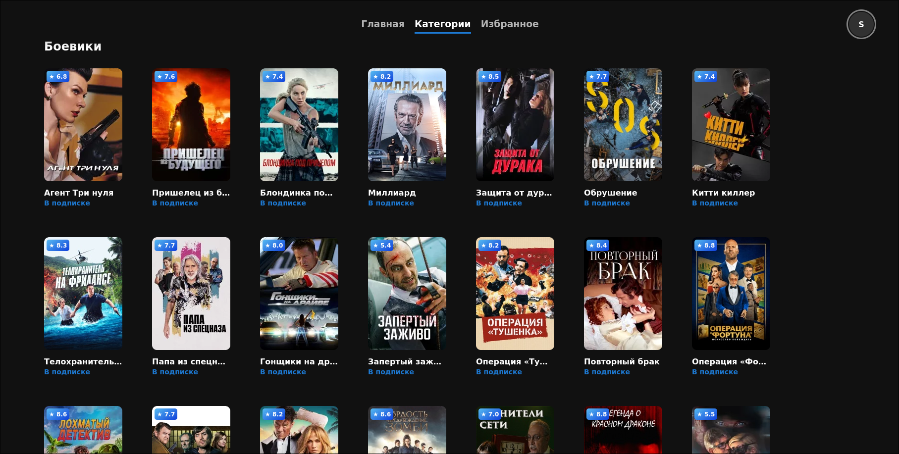
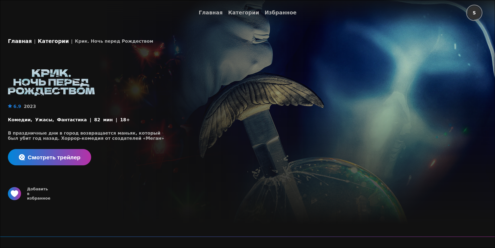
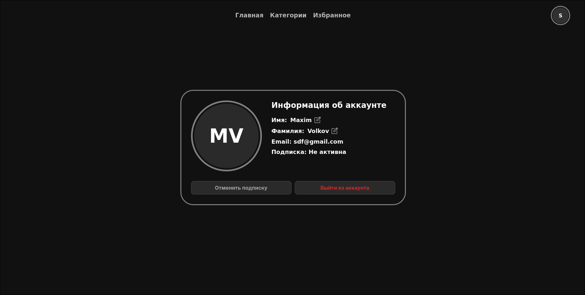

# Kino Flow

   

# About the project

The inspiration for this project came from the websites KINOPOISK and WINK, which formed the basis of our design. The project was created to gain new knowledge and hone existing skills, as well as to gain experience working in a team. For both of us, a website of this kind was new, but we coped with the task and were pleased with the result. During the creation of the project, we got acquainted with Firebase, as well as parsing in Python. The development of the project lasted about a month.

# Installing

### 1. Clone the repository:

```bash
git clone https://github.com/Kaden09/Kino.git
```

### 2. Install dependencies:

```bash
npm install
```

### 3. Start the project:

```bash
npm run dev
```

# Usage

Open `
http://localhost:3000
` is your browser

# Contacts

email: m.volkov.dev@gmail.com  
telegram: https://t.me/kaden70  
github: https://github.com/Kaden09  

#4A6BFFч